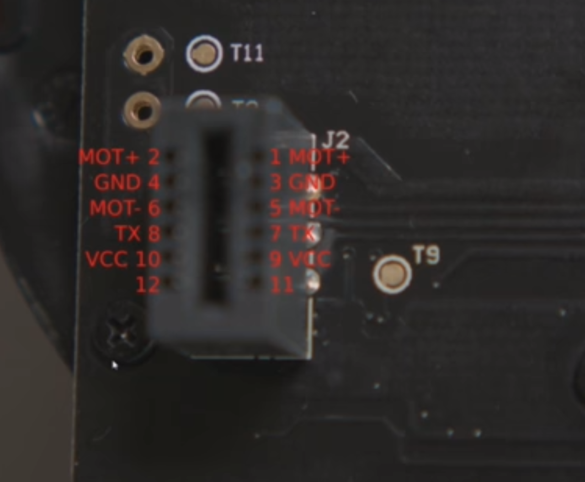

# ROS 2 Driver for XV-11 Lidar
This is a reimplementation of existing XV-11 drivers
(credit to [this](https://github.com/mjstn/xv_11_driver), firmware=2) in python for use in ROS 2, called xv11_lidar_python.

This driver works well for a broad range of vacuum robot lidars, which are cost efficiently available.

## Usage
The common pinout of these chinese lidars are usually as follows:

It is confirmed to be for working for Xiaomi Lidars (S7, S70, S75) and probably many more.
Let me know if it worked for your model, so the list can be updated!

## Install
Place this repository in your colcon_ws workspace

    cd ~/colcon_ws/src
    git clone <this-repository>
    cd ..
    colcon build

Once it has been made and registered by sourcing it to your environment you may run it as follows:

The following ROS2 parameters are defaulted as below and can be set using parameters

    port              /dev/ttyXV11
    frame_id          xv11_lidar
    range_min         0.06
    range_max         13.0

Run the driver and it should generate scan data on topic /scan

    ros2 run xv11_lidar_python xv11_lidar

Run the driver using a different port and frame_id

    ros2 run xv11_lidar_python xv11_lidar --ros-args -p port:=/dev/ttyAMA0 -p frame_id:=xiaomi_lidar

If all goes well this will produce messages of type LaserScan on topic /scan.

## :heart: Credits and many thanks to

[https://wiki.recessim.com/view/Xiaomi_Roborock_LIDAR](https://wiki.recessim.com/view/Xiaomi_Roborock_LIDAR)

[https://wiki.recessim.com/view/Neato_XV-11#LIDAR_Sensor](https://wiki.recessim.com/view/Neato_XV-11#LIDAR_Sensor)

[https://github.com/mjstn/xv_11_driver](https://github.com/mjstn/xv_11_driver)
